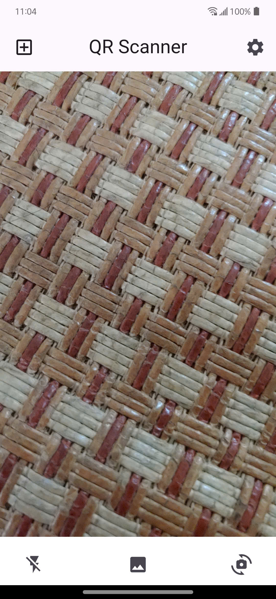
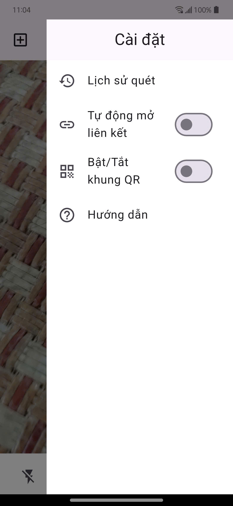
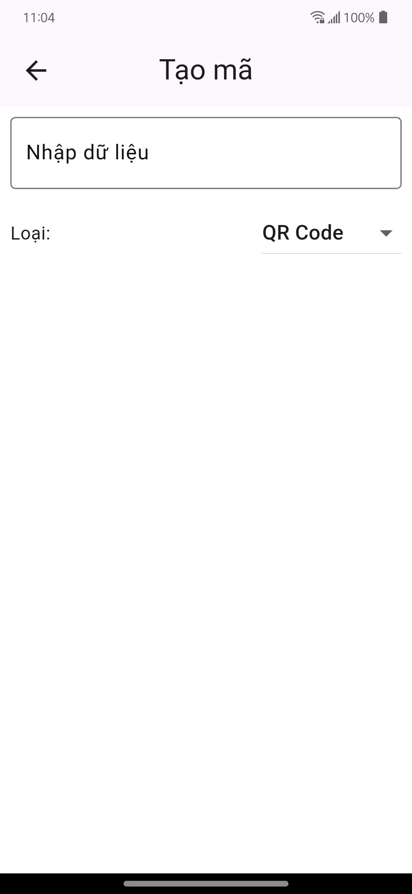

# QR_CodeApp

A QR code app.

## Version
**Version 0.1.0:**
Support Flash(on/off), Gallery, Camera (front, selfie).

**Version 1.0.0:**
1. Improved performance and stability.
2. Enhanced camera support (front/rear switching optimized).
3. Flash toggle improved.
4. Added image picker from gallery.
5. Added Scan History feature to view previous scanned results.
6. Added Auto-open link option for scanned URLs.

**Version 1.1.0:**
Add pinch-to-zoom feature for camera using two fingers and optimize performance.

**Version 1.2.0:**
Improved performance and stability
Added code QR, ISBN, Aztec, ... and save image

## Result app show img
   